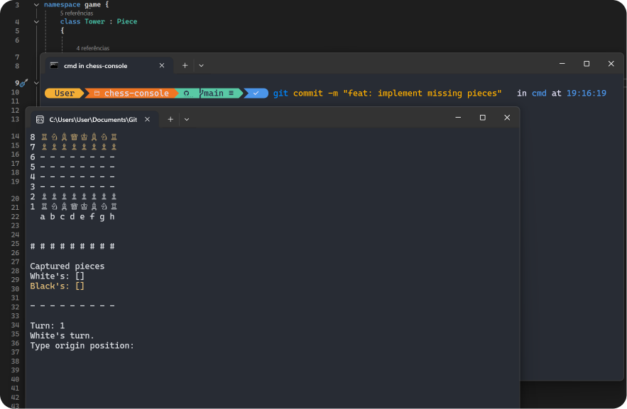

# C# Console Chess
## Overview
A simple console-based chess game using C#. 

### Features
> **Basic Chess Rules:** Implemented the core rules of chess - movement of pieces, captures, and checkmate.

> **Player Turn Management:**  Alternate turns between two players.
Input Validation: Ensure valid moves and prevent illegal actions.

> **Game Over Detection:** Determines when a game is over due to checkmate.

## Setup
### Pre-requisites:
* Visual Studio or .NET Core SDK; 

Install the appropriate development environment.
Clone this repository, and build compile the project using your chosen development environment.
On executing the compiled application, the game will display a cmd basic chessboard representation.